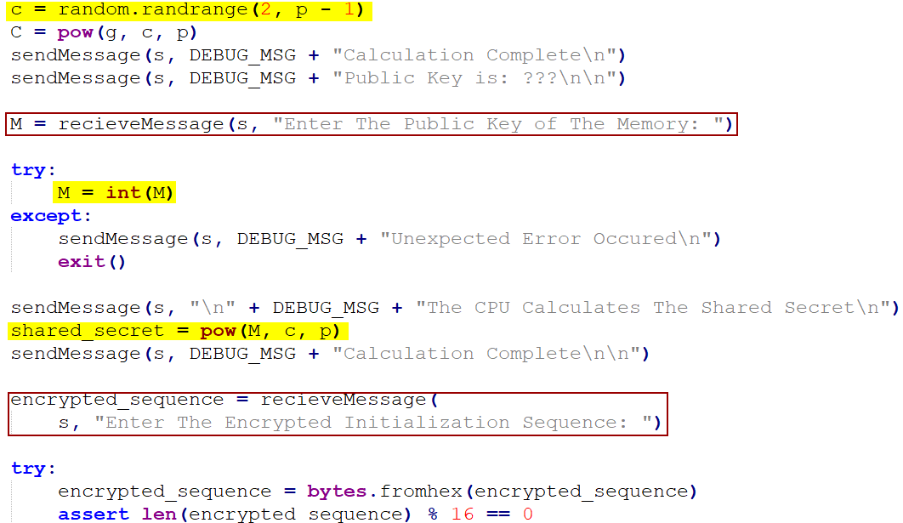
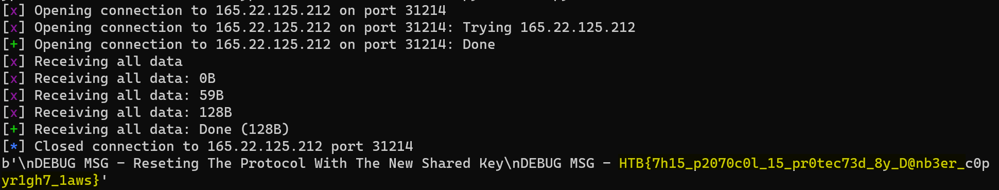
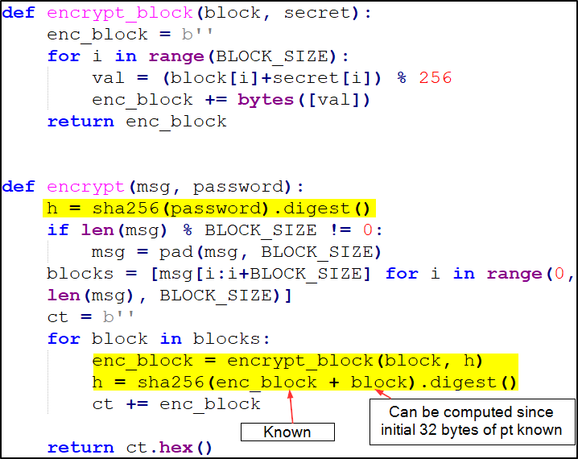
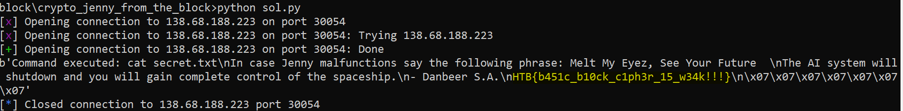
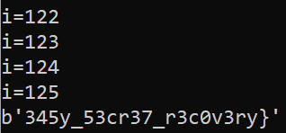
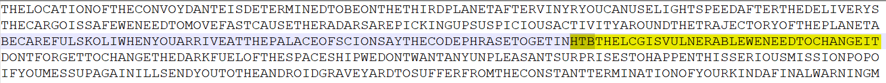

## Android-in-the-Middle

This challenge involves a MITM attack with the Diffie-Hellman protocol. Looking at the source code, we see that input needs to be supplied in 2 areas (in the red boxes): 

- Public Key of the Memory

- Encrypted Sequence in Hex



From the highlighted lines, we see that the variable *c* is unknown, and our supplied *M* will be raised to the power of *c* to become the shared_secret. I also note the following:

1. This shared_secret will subsequently be used to decrypt our supplied encrypted_sequence

2. The only limitation is that *M* needs to be an integer

In order to control the value of the shared_secret, we can set *M* to the value of **1**, such that the shared_secret will always be equals to **1** since 1 raised to the power of anything will still be 1.

After knowing the shared_secret, we can then encrypt the required bytes (**Initialization Sequence - Code 0**) with the shared_secret and use that as the encrypted_sequence in the script below:

```python
from Crypto.Cipher import AES
from Crypto.Util.number import long_to_bytes
import hashlib
from pwn import *    

def encrypt(decrypted, shared_secret):
    key = hashlib.md5(long_to_bytes(shared_secret)).digest()
    cipher = AES.new(key, AES.MODE_ECB)
    message = cipher.encrypt(decrypted)
    return message

p = remote('165.22.125.212',31214)
p.sendlineafter(b'Memory: ', b'1')
decrypted = b"Initialization Sequence - Code 0"
shared_secret = 1
sequence = bytearray(encrypt(decrypted,shared_secret).hex(),'utf-8')
p.sendlineafter(b'Sequence: ', sequence)
print(p.recvall())
```

Running the script yielded the flag:



`HTB{7h15_p2070c0l_15_pr0tec73d_8y_D@nb3er_c0pyr1gh7_1aws}`

---

## Jenny from the Block

This challenge involves sending a list of approved commands (**whoami/ls/cat secret.txt/pwd**) and receiving the encrypted response from the server. Immediately  **cat secret.txt** stands out and is likely the command that we need to execute. The encryption function is as follows:

 

Looking at the encryption function, I see that the *secret* is constantly updated based on the <u>current plaintext block</u> and <u>current encrypted block</u>. Since this is known initially only for the first block: "*Command executed: cat secret.txt*", we can use this to calculate h and brute force the plain text for the next block. After this plain text is obtained, we can just repeat till the entire message is decoded.

The code is as follows: 

```python
from pwn import *
from Crypto.Util.number import *
from hashlib import sha256

p = remote('138.68.188.223',30054)
command = b'cat secret.txt'
pt = b'Command executed: ' + command
p.sendlineafter(b'>',command)
result = p.recvline()[1:-1]
encrypted = long_to_bytes(int(result,16))

for j in range(0,len(encrypted),32):
    try:
        currblock = encrypted[j:j+32]
        nextblock = encrypted[j+32:j+64]
        curr_plaintext = pt[j:j+32]
        h = sha256(currblock + curr_plaintext).digest()
        for i in range(32):
            for k in range(256):
                if (k + h[i]) % 256 == nextblock[i]:
                    pt += bytes([k])
                    break
    except:
        continue

print(pt)
```

Running the code above produced the flag:



`HTB{b451c_b10ck_c1ph3r_15_w34k!!!}`

---

## The Three-Eyed Oracle

Writeup Reference: [Simple Attack On AES-ECB Mode](https://dr3dd.gitlab.io/cryptography/2018/10/11/Simple-Attack-On-AES-ECB-Mode/)

From the reference, the steps were pretty much the same except that I needed to be mindful of padding as the flag was longer than 16 bytes and needed to account for padding when brute forcing after 16 bytes.

```python
from pwn import *
from Crypto.Util.number import *

p = remote('138.68.139.197',30460)
filler = b'1111'
part1 = b'1' * 11 + b'HTB{'
part2 = b'1' * 11
known = b''
need_padding = False

while True: 
    if known[:-1] == b"}":
        break
    if len(known) >= 12:
        part2 = b'1' * (15 - (len(known) - 12))
        need_padding = True

    for i in range(32,128):
        print(f"{i=}")
        char = bytes([i])
        total = (filler + part1 + char + part2).hex()
        p.sendlineafter(b'> ', total)
        enc = p.recvline().strip()
        b1 = enc[32:64]
        if need_padding == True:
            b2 = enc[96:128]
        else:
            b2 = enc[64:96]
        if b1 == b2 :
            enc_bytes = long_to_bytes(int(enc,16))
            known += char
            part1 = part1[1:] + char
            part2 = part2[1:]
            print(known)
            break
```

After around 10 minutes of running the script above, the portion of the flag after **HTB{** is obtained:



`HTB{345y_53cr37_r3c0v3ry}`

---

## How The Columns Have Turned

```python
def deriveKey(key):

    derived_key = []

    for i, char in enumerate(key):
        previous_letters = key[:i]
        new_number = 1
        for j, previous_char in enumerate(previous_letters):
            if previous_char > char:
                derived_key[j] += 1
            else:
                new_number += 1
        derived_key.append(new_number)
    return derived_key

def transpose(array):
    return [row for row in map(list, zip(*array))]


def flatten(array):
    return "".join([i for sub in array for i in sub])

key = str(729513912306026)
derived_key = deriveKey(key)
width = len(key)
mapping = {}

with open('encrypted_messages.txt', 'r') as f:
    encrypted_messages = [msg.strip() for msg in f.readlines()]

orig_index = [derived_key.index(i + 1) for i in range(width)]
for position, number in enumerate(orig_index):
    mapping[number] = position
        
for e in encrypted_messages:
    length = len(e) // width
    unflattened_unreversed_blocks = [e[i:i + length][::-1] for i in range(0, len(e), length)]
    post_transpose = [unflattened_unreversed_blocks[mapping[i]] for i in range(width)]
    pre_transpose = [''.join(i) for i in transpose(post_transpose)]
    pt = flatten(pre_transpose)
    print(pt)
```



`HTB{THELCGISVULNERABLEWENEEDTOCHANGEIT}`
