## Golden Persistence

Open NTUSER.dat in Registry Explorer, look at Run Key for persistence

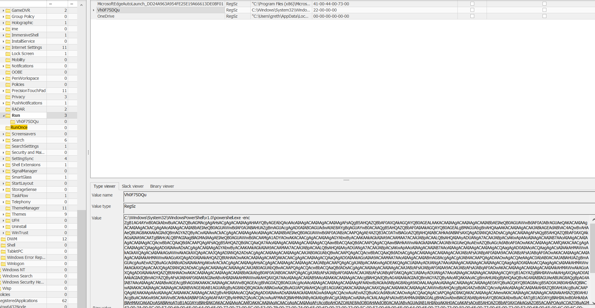

1. Convert base64 and obtained the following script

2. Replaced some code (Commented code in green) with the actual key values at that location

3. Changed to Write-Output instead of IEX and obtained the flag

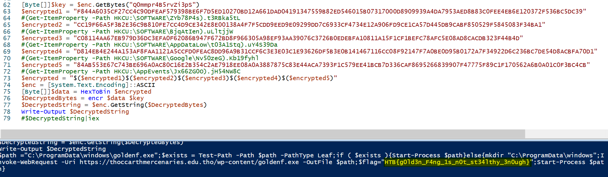

`HTB{g0ld3n_F4ng_1s_n0t_st34lthy_3n0ugh}`

---

## Puppeteer

Folder of evtx files :

1. Processed with EvtxECmd to consolidate all the logs

2. TimelineExplorer for easy analysis and keyword searching of logs

3. Searched for ps1 and receieved following output: 
   
   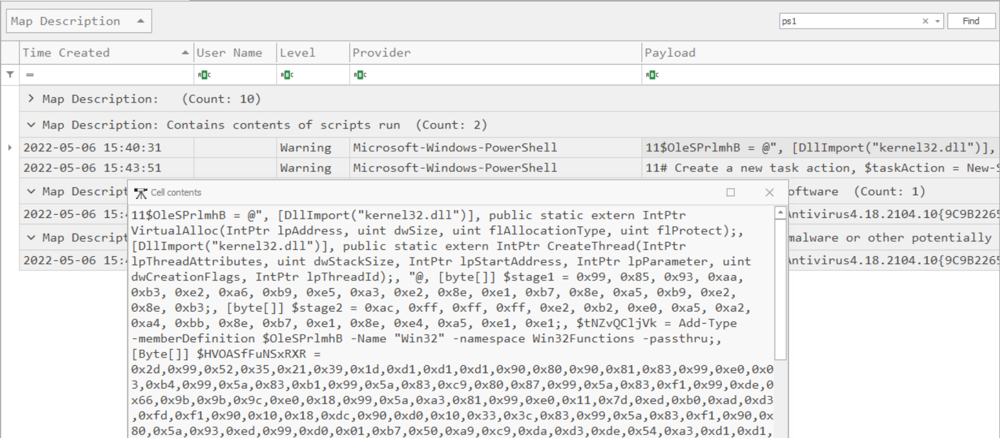

Copied over the script and nicely formatted it:

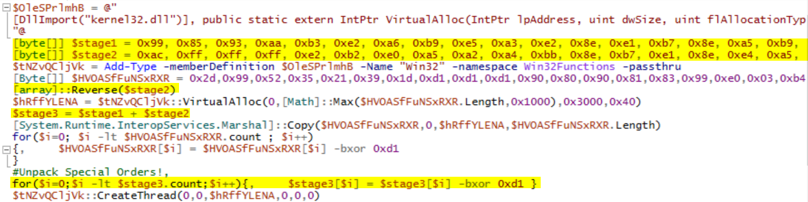

Highlighted lines above are the only lines that are important (The rest could just be distractions)

- Got a little bit caught up in trying to make the here-string work in PS (Needs to be separate lines!)

- Found a useful PS guide (https://www.red-gate.com/simple-talk/wp-content/uploads/imported/2289-PSPunctuationWallChart_1_0_3.pdf?file=12022)

Took the \$stage3 variable to Cyberchef and converted from decimal 

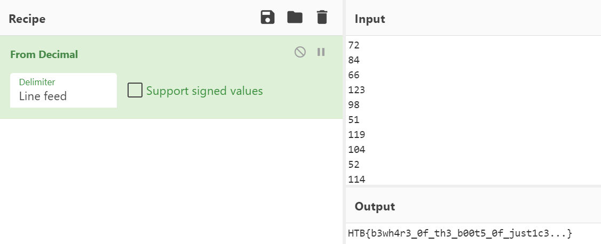

`HTB{b3wh4r3_0f_th3_b00t5_0f_just1c3...}`

---

## Automation

Browsed file in Wireshark and saw an interesting HTTP object:

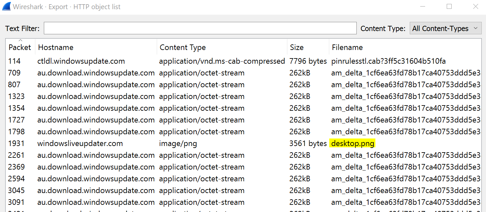

Downloaded and base64 decoded "**desktop.png**" to reveal the following script:

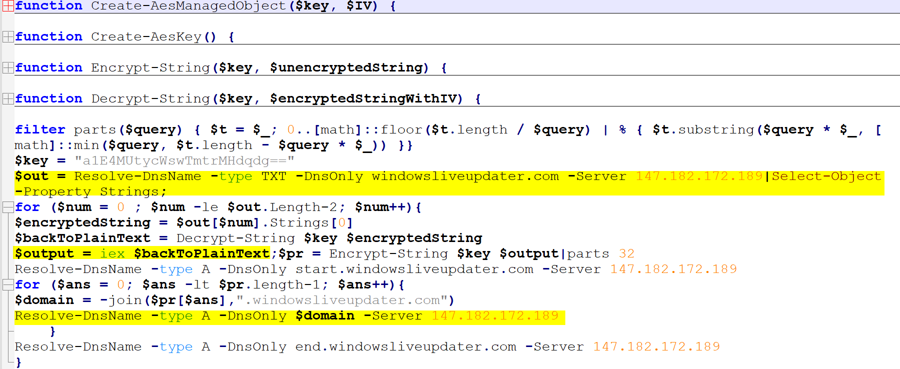

<u>Looking at highlighted lines from the top:</u>

1. Script extracts the **TXT** records from *windowsliveupater.com* and IP address of *147.182.172.189*
   
   - I extracted those records with: **tshark -r capture.pcap -T fields -E separator=, -e dns.txt -Y "((dns) && (dns.resp.type == 16))" > TXT.csv**
   
   - I then replaced \$out variable with the cleaned up and extracted TXT records
     
     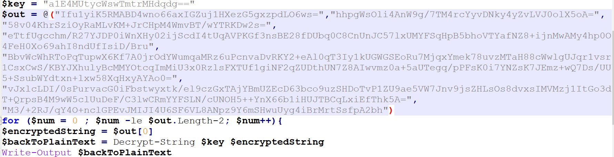

2. The script decrypts the results for me and all I need to do is change IEX to Write-Output for the variable \$backToPlainText
   
   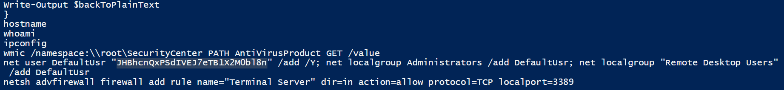
   
   - Converting highlighted to base64, we get the first part of the flag:
   
   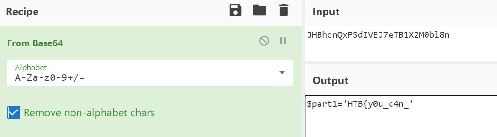
   
   - $part1='HTB{y0u_c4n_'

3. I note that the \$output variable is subsequently re-encrypted and exfiltrated in a type **A** record
   
   - I extract the type A records with the following: **tshark -r capture.pcap -T fields -E separator=, -e dns.resp.name -Y "((dns) && (ip.dst == 10.0.2.15)) && (dns.resp.name contains "windowsliveupdater.com")" > A_record.csv**
   
   - Tidying out the A_record.csv, I see the following: 
   
   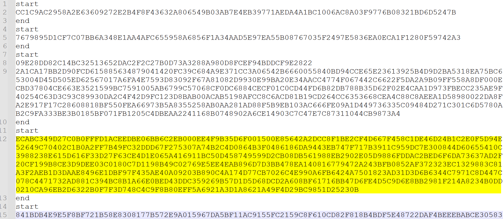
   
   - Each **start/end** corresponds to the output of the commands in $backToPlainText in order (e.g 1st start/end is the result of **hostname**, 2nd is **whoami**, etc.)
   
   - The command on the 4th line which /GETS the value of **AntivirusProduct** looks interesting and so I unhex and base64 decode it in Cyberchef
     
     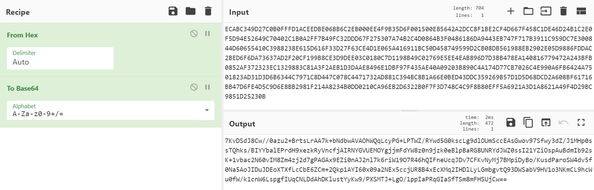
   
   - I put the output in a variable called \$part4 and then decrypt the result to obtain the second part of the flag
   
   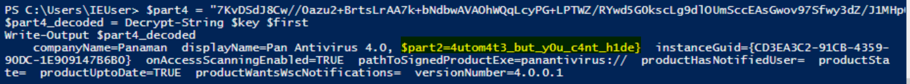

\$part2=4utom4t3_but_y0u_c4nt_h1de}

Combining: `HTB{y0u_c4n_4utom4t3_but_y0u_c4nt_h1de}`

---

## Free Services

Challenge involves excel 4.0 macros (predecessor of VBA):

- NOTE: To run the macros, right click the cell and click **run**! 

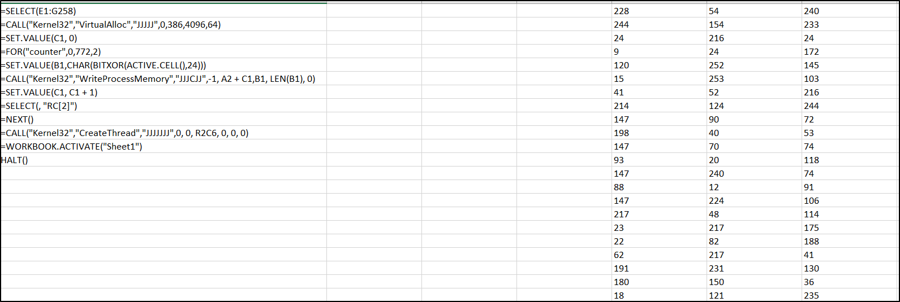

**Some observations after reading the helpful [documentation](https://docs.excel-dna.net/assets/excel-c-api-excel-4-macro-reference.pdf) :**

- "JJJJJ":  First char specifies the return type of the function as well as the type for the corresponding 4 arguments

- All the calculations are done in **B1** and it is then written to the memory

- Only half the values in the array are used: Every 2nd value since only **386** bytes are allocated and the counter increments by 2 everytime

- RC[2]: Same row but 2 columns to the right (E1 -> E3 -> F2 -> G1 -> G3 etc.)

Added the following functions to print the value of the **B1** in addition to writing it to process memory:

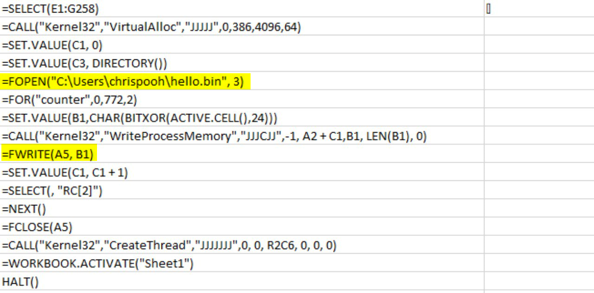

Opened "**hello.bin**" and saw the flag at the bottom:

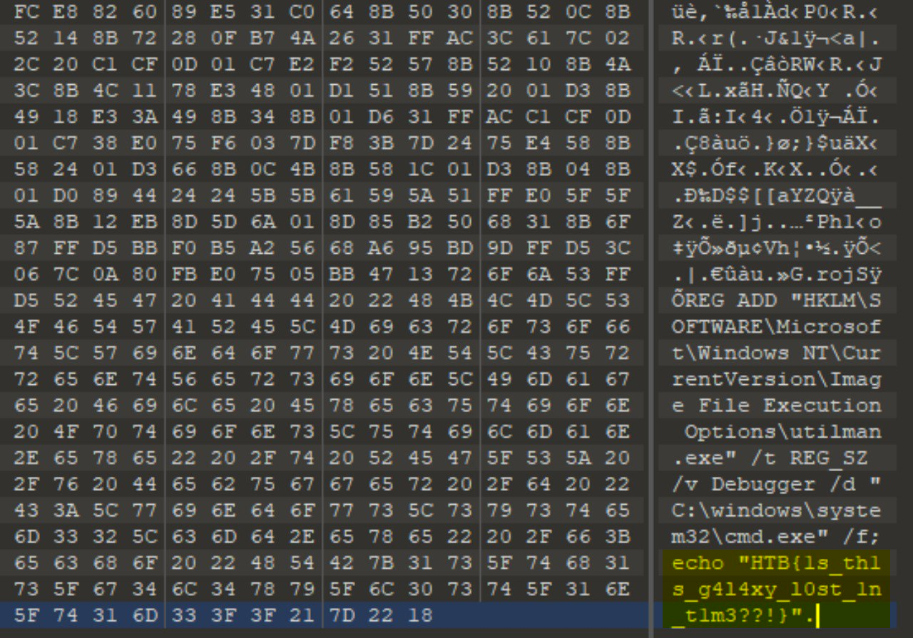

`HTB{1s_th1s_g414xy_10st_1n_t1m3??!}`

---

## Seized

Took reference from this [writeup.]([Sieberrsec 3.0 CTF (2021) - Digging in the Dump (Forensics) - Nandy Narwhals CTF Team ▌](https://nandynarwhals.org/sieberrsec-ctf-3.0-digginginthedump/))

Files of Interest:

- "**AppData\Local\Google\Chrome\User Data\Local State**" - Json file that stores Chrome's current configuration but we are only interested in the AES key needed to decrypt the password 
  
  - NOTE: This DPAPI AES key needs to first be decrypted by the **masterkey**

- "**AppData\Local\Google\Chrome\User Data\Default\Login Data**" - Sqlite3 DB that contains the URL, username, and <u>encrypted passwords</u> [Password field in Nirsoft's ChromePass appears *blank*]

- "**AppData\Roaming\Microsoft\Protect\S-1-5-21-3702016591-3723034727-1691771208-1002\865be7a6-863c-4d73-ac9f-233f8734089d**" - Masterkey that can only be determined from the user's logon password

<u>Step 1: Extract encrypted AES key from the **Local State** file:</u>

We see the **DPAPI** prefix that needs to be removed:  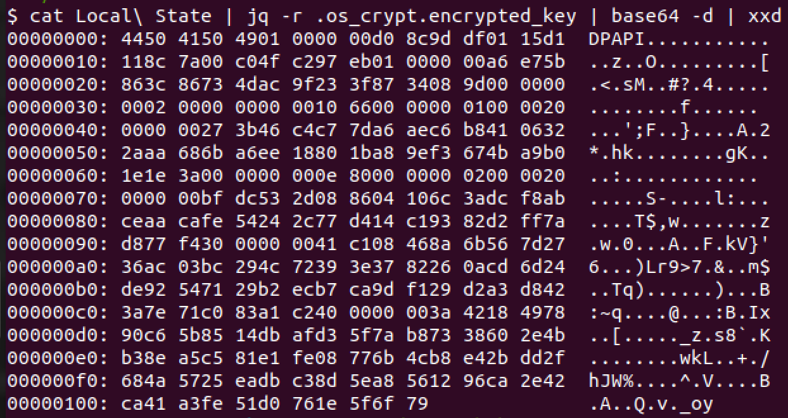

```python
import json, base64

x = json.load(open('./AppData/Local/Google/Chrome/User Data/Local State', 'rb'))['os_crypt']['encrypted_key']

x = base64.b64decode(x)

open("blob",'wb').write(x[5:]) #removing DPAPI prefix
```

Extracted to **blob** with the script above 

<u>Step 2: Convert the masterkey to john format: </u>

Masterkey can only be obtained with the user's Windows password, which will be cracked in the next step 

`python3 DPAPImk2john.py -S S-1-5-21-3702016591-3723034727-1691771208-1002 -mk /media/sf_forensics_seized/AppData/Roaming/Microsoft/Protect/S-1-5-21-3702016591-3723034727-1691771208-1002/865be7a6-863c-4d73-ac9f-233f8734089d -c local > dpapi.hash`

<u>Step 3: Cracking with john: </u>

**john dpapi.hash --wordlist=/usr/share/wordlists/rockyou.txt**

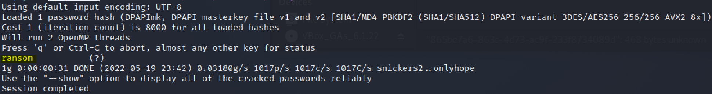

- PW: ransom

<u>Step 4: Use Mimikatz to obtain master key: </u>

`dpapi::masterkey /in:Z:\forensics_seized\AppData\Roaming\Microsoft\Protect\S-1-5-21-3702016591-3723034727-1691771208-1002\865be7a6-863c-4d73-ac9f-233f8734089d /sid:S-1-5-21-3702016591-3723034727-1691771208-1002 /password:ransom /unprotect`

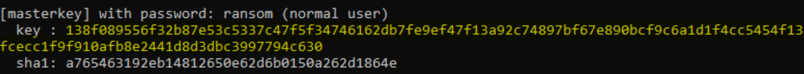

<u>Step 5: Decrypting blob with the masterkey</u>

Use the following command:

`dpapi::blob /masterkey:138f089556f32b87e53c5337c47f5f34746162db7fe9ef47f13a92c74897bf67e890bcf9c6a1d1f4cc5454f13fcecc1f9f910afb8e2441d8d3dbc3997794c630 /in:Z:\forensics_seized\blob /out:Z:\forensics_seized\blob.dec`

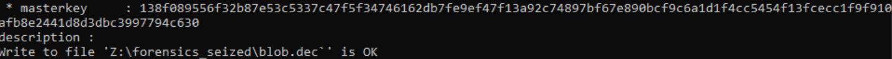

Outputted file: **blob.dec** to be used in next step

<u>Step 6: Running a script to decrypt the Chrome password file</u>

We can see the PW is encrypted in the screenshot below:

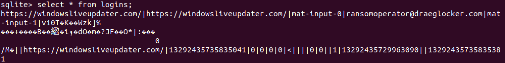

We now run the script below to extract and decrypt the password: 

```python
import sqlite3
from Cryptodome.Cipher import AES

def decrypt_password(ciphertext, secret_key):
    try:
        #(3-a) Initialisation vector for AES decryption
        iv = ciphertext[3:15]
        #(3-b) Get encrypted password by removing suffix bytes (last 16 bits)
        #Encrypted password is 192 bits
        encrypted_password = ciphertext[15:-16]
        #(4) Build the cipher to decrypt the ciphertext
        cipher = AES.new(secret_key, AES.MODE_GCM, iv)
        decrypted_pass = cipher.decrypt(encrypted_password).decode()
        return decrypted_pass
    except Exception as e:
        print("%s"%str(e))
        print("[ERR] Unable to decrypt, Chrome version <80 not supported. Please check.")
        return ""

secret_key = open('blob.dec', 'rb').read().strip()
db = sqlite3.connect("./AppData/Local/Google/Chrome/User Data/Default/Login Data")

cursor = db.cursor()
cursor.execute("SELECT origin_url, username_value, password_value FROM logins")
for login in cursor.fetchall():
    url = login[0]
    username = login[1]
    ciphertext = login[2]
    decrypted_password = decrypt_password(ciphertext, secret_key)
    print("URL: %s\nUser Name: %s\nPassword: %s\n"%(url,username,decrypted_password))
```

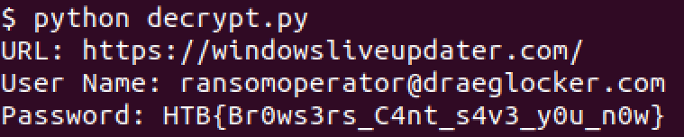

`HTB{Br0ws3rs_C4nt_s4v3_y0u_n0w}`

NOTE: Steps 1,5,6 can be bypassed with mimikatz's **dpapi::chrome** module


---

## Intergalatic Recovery

The damaged disk was rebuilt using the tool: [xorfiles](https://www.nirsoft.net/utils/xorfiles.html) by nirsoft 

<u>Treat disk images as block devices</u>

`sudo losetup /dev/loop1 disk1.img `
`sudo losetup /dev/loop2 disk2.img `
`sudo losetup /dev/loop3 disk3.img `

<u>Rebuilding RAID 5</u>

`sudo mdadm --create --assume-clean --level=5 --raid-devices=3 /dev/md0 /dev/loop2 /dev/loop3 /dev/loop1`

<u>Mounting the rebuilt RAID array</u>

`mount /dev/md0 /mnt`

We find a PDF file (imw_1337.pdf) in the mounted device with the flag:
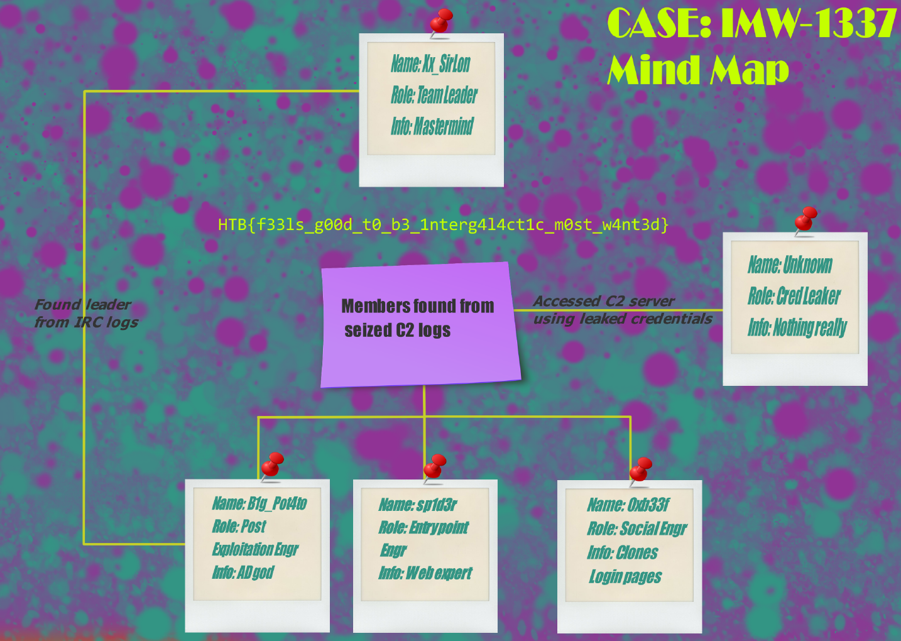

`HTB {f33ls_g00d_t0_b3_1nterg4l4ct1c_m0st_w4nt3d}`

---
